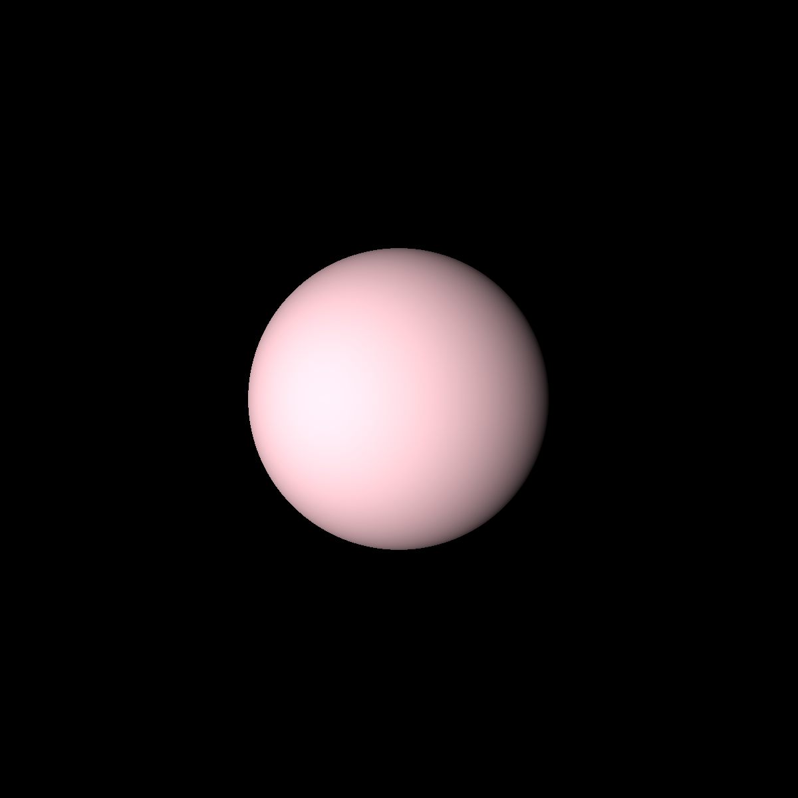
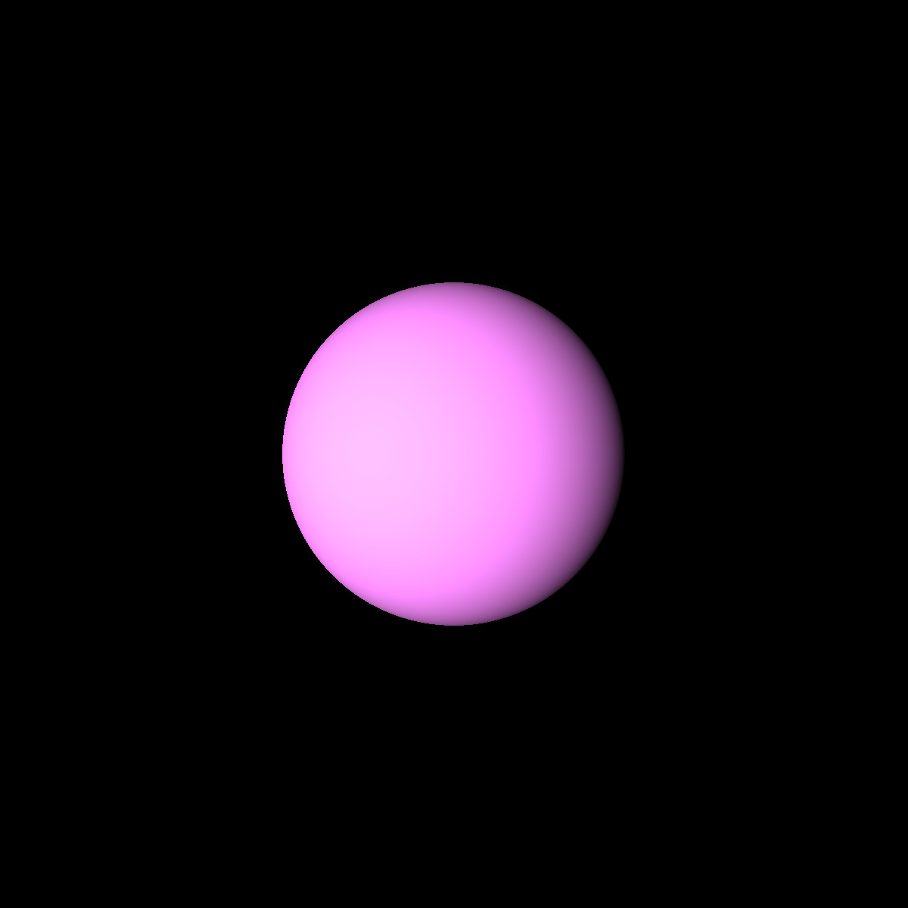
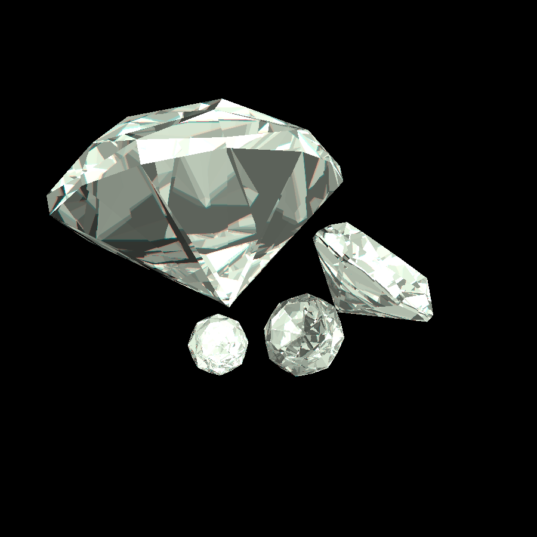
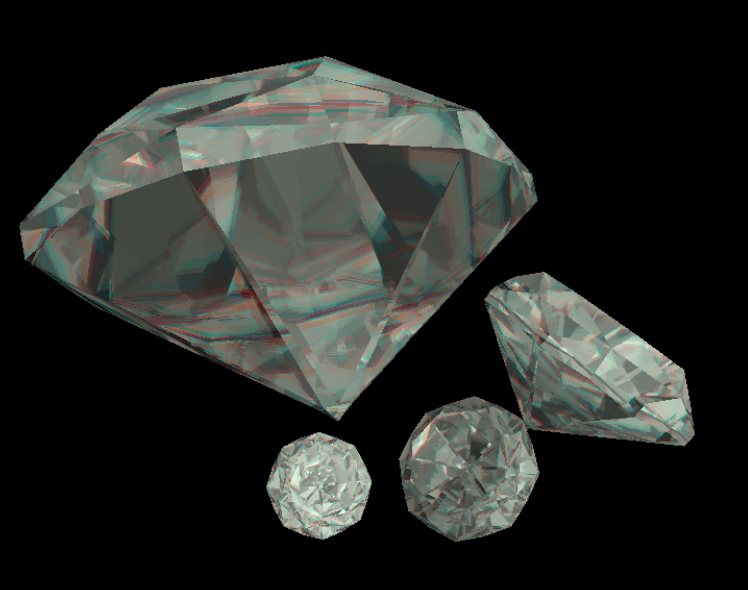
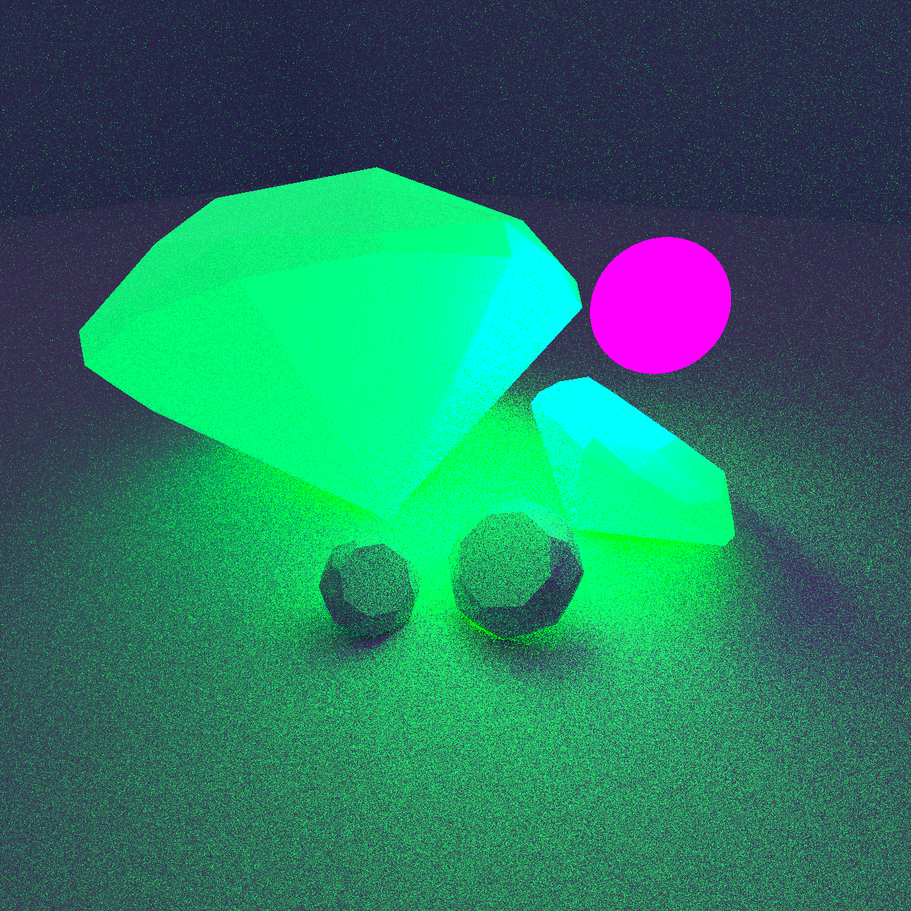
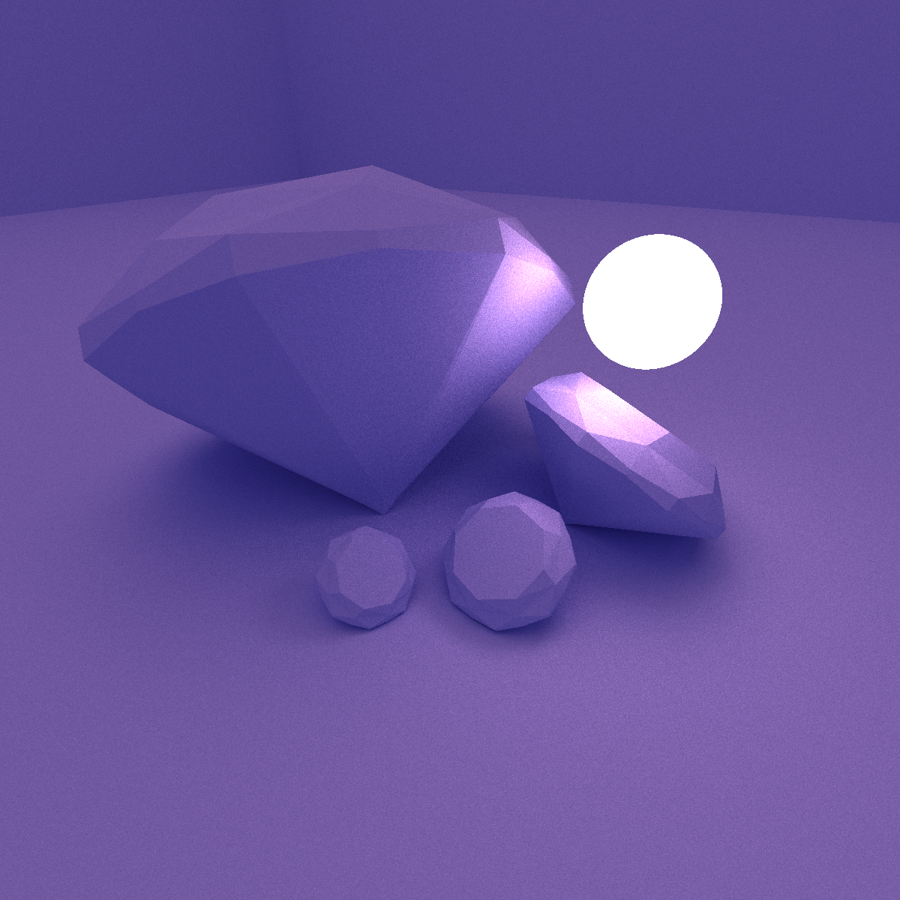
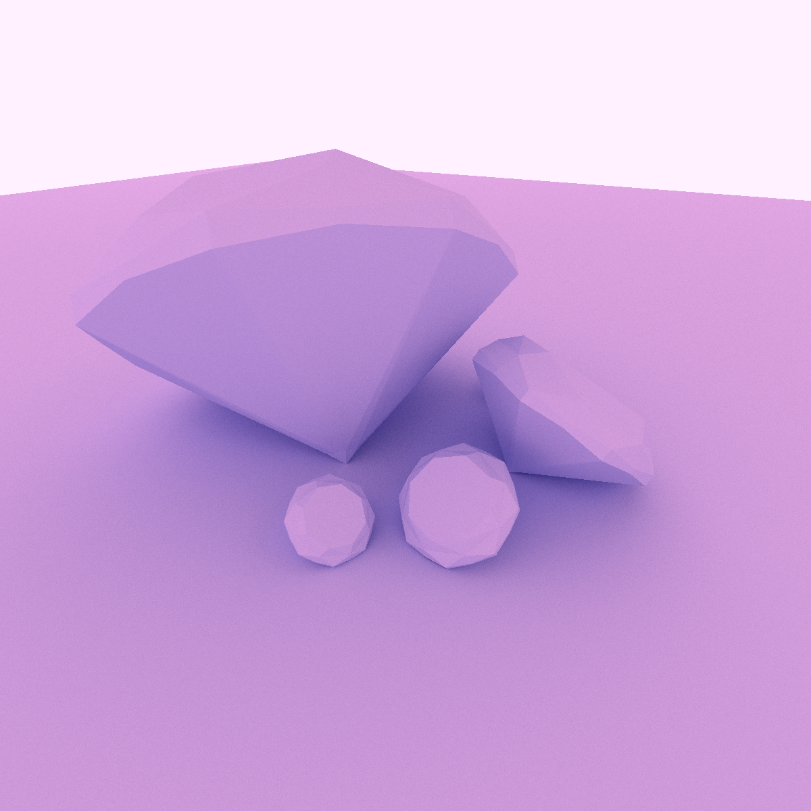
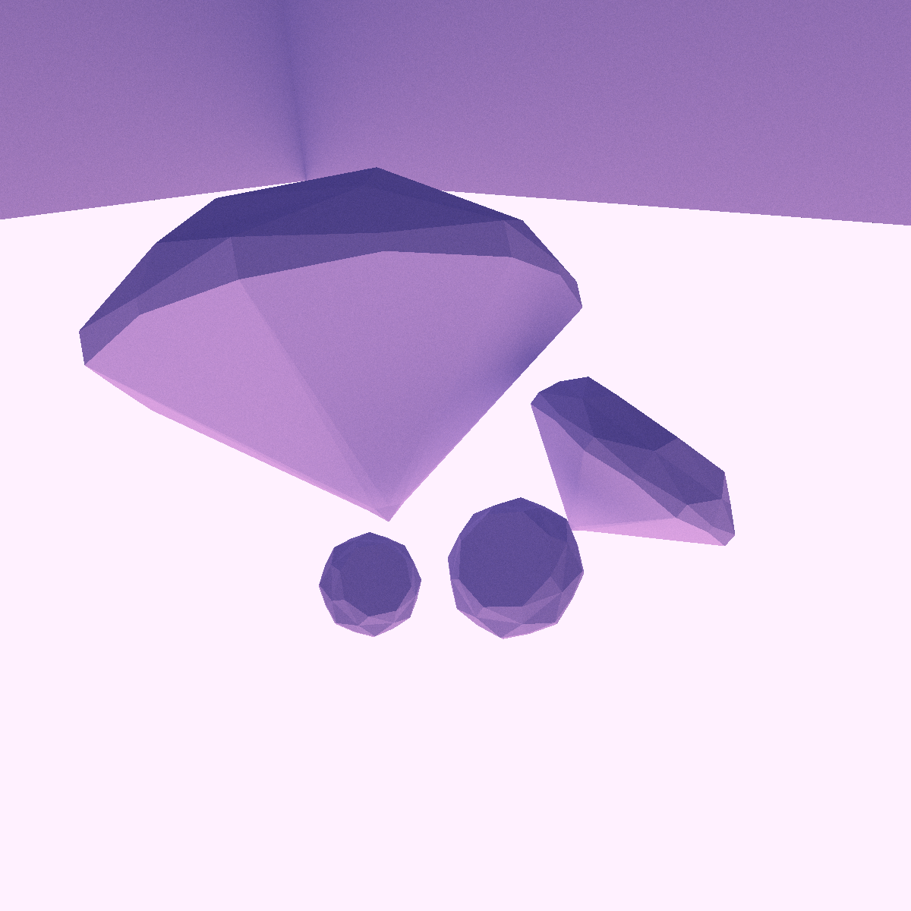
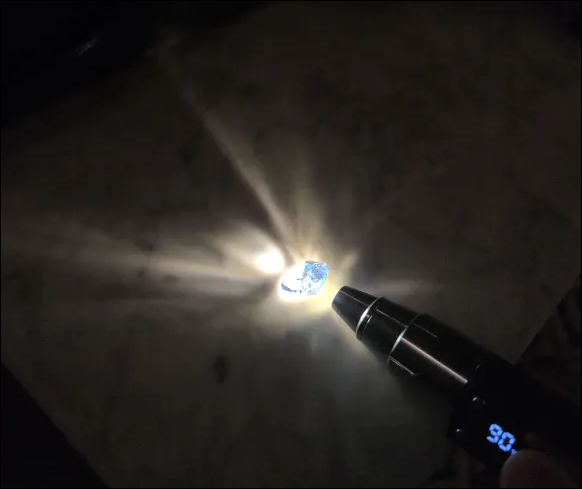
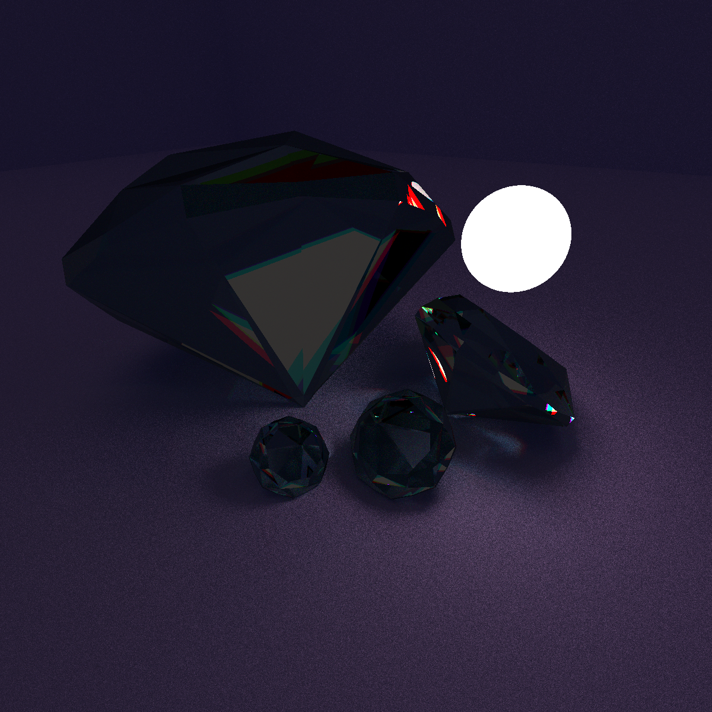

# Project 6: Final Project Gear Up

The project handout can be found [here](https://cs1230.graphics/projects/final/gear-up).

## Test Cases

### Spectral Rendering

Spectral rendering was the main pipeline overhaul for this project. At its core, it essentially boils down to representing rays with a value for every wavelength of light, not just r, g, and b colors. This entire spectrum of light is used to render the scene, which is then converted to XYZ colorspace and then RGB. By using this more unique technique of rendering, we can get some cool effects in exchange for some higher significant overhead.

#### Spectral Materials

Now that spectral rendering is being used, the way materials are modeled becomes very different. Instead of approximating the lighting with the phong model, we use physically accurate qualities to model how light interacts with a surface. This means our materials are defined with Fourier transforms that represent different "functions" that light goes through as it hits a surface. An example of this is the absorbtion property.

This property determines how much light is reflected back given a wavelength. You can think of this as the albedo, or natural color of a material. By varying values at different wavelengths, we can "reflect" or "absorb" the colors we want to determine the color of the material.

| Sphere 1 | Sphere 2 |
| -------- | -------- |
|   |  |

Here we can observe the color of the sphere change with a different absorbtion property. While this is a relatively basic and easy to emulate quirk of spectral lighting, it is the foundation for the features continued down below.

#### Dispersion

Within our spectral materials, we can model dispersion now using a lesser-known quality of translucent materials - the varying of indexes of refraction. Typical raytracing models refraction by giving a material a single index of refraction that determines how light refracts. However, in real life, this index of refraction varies by wavelength. Because of this, light splits across wavelengths as it hits a translucent material, and if it travels or bounces far enough with enough variance in where it lands, we can actually see the color split. While this is borderline impossible to model in typical raytracing, we can model this quite easily with spectral rendering. To do this, we give our material another Fourier transform that represents indices of refraction for a given wavelength. Then as a ray hits the material, we can spawn and split secondary rays accordingly to get a nice dispersion effect:

| Minor Dispersion | Major Dispersion |
| -------- | -------- |
|  |  |

By increasing the variance in our indices of refraction, we can get even stronger dispersive effects, or have more subtle/minor ones.

#### Fluorescence

Another unique phenomenon that spectral rendering can offer is the ability to model materials with fluorescence. This is because we can model wavelengths of light outside of the visible spectrum! What fluorescence actually is is when a material takes in a wavelength of light and reflects it as a different wavelength. For example, a material can take in an invisible wavelength of light (commonly ultraviolet light) and reflect it back as visible green light. This makes it look like the material is glowing, because we can only see the light that is being reflected back. This phenomenon can be thus easily modeled by giving our materials another Fourier transform property, the convert function. This function takes in a wavelength of light and returns the corresponding wavelength that it converts to. By applying this function after processing our lighting, we can then convert the light the same way fluorescent materials do:

#### Fluorescence under UV
https://github.com/user-attachments/assets/92c47642-d6c2-467f-909e-494c9fa1a3e4

This video shows some of the materials glowing as the light slowly turns into UV light!

### Pathtracing

Spectral rendering can be very cool, but the effects are not as nearly as interesting because many of them require global illumination to truly shine. It is difficult otherwise to truly see a fluorescent material "glow", or a prism split light into a rainbow. However, global illumination is not very possible with basic raytracing. Thus, pathtracing has been implemented as to truly appreciate the possible effects of spectral rendering.

#### Global Illumination

Global illumination is achieved by bouncing materials uniformly according to a material's BRDF, and then averaging them together (Monte Carlo sampling). Russian roulette is used to balance ray intensities and drop paths if the throughput gets too narrow. As a path bounces around the scene, each material applies it's absorbtion with its brdf to narrow the throughput, so when it hits a light all the absorbtions are essentially applied. This allows us to formulate global illumination in our scenes, since it picks up accurately where ambient light possibly came from, whether it be from a direct light or reflected off of nearby surfaces.

| Dispersion | Fluorescence |
| -------- | -------- |
|  |  |

Now that global illumination is implemented, we can see the dispersed light on nearby surfaces when doing dispersion, and fluorescent materials glow onto other surfaces.

#### Emission

Now that global illumination is implemented, implementing more interesting lighting actually becomes quite trivial. This is because we can now give materials an "emission" property, which dictates how it emits light. Thus, when a path hits the material, it will see that light and propogate it throughout the scene. Since shadows should uniformly sample these emissive lights, it generates soft shadows similarly to how area lights should.

| Spherical Light | Wall Light| Floor Light |
| -------- | -------- | -------- |
|  |  |  |

#### Everything, Everywhere, All At Once

Putting it all together, I can show a little video of all these effects at once! However, pathtracing these spectral effects takes a lot of samples to converge, which would take especially long to render 600 frames for a 10 second video. So, since I'm out of time, you'll have to hopefully be pleased by a 4 sample per-pixel 600x600 video.

#### Video

[Drive Link (video too large to host on github) (if the quality is too bad then just download and view it)](https://drive.google.com/file/d/1Qq9ypu-5E7b7W3uolTJgOTPol57JVpl2/view?usp=sharing)

## Design Choices

Overall, the design has been changed from the basic raytracer with the following main differences:

1. The Spectrum class - represents a spectrum of wavelengths of light, as conversed to the r, g, and b bands.
2. The Fourier class - represents a fourier transform, making it very easy to seamlessly represent continuous change in behavior of a physcial property.
3. BRDF - the ability for materials to produce a uniformly possible random path for path tracing
4. OBJ - scenes are now loaded from the typical .obj file, so scenes can be modeled in typical modeling softwares (e.g. blender) or even downloaded online and loaded in the renderer.

These core classes lets us refactor the pipeline to accomodate the needed features for our renderer.

Otherwise, the general architecture is very similar to the previous project raytracer, in which scenes can be loaded with a parser, then the scene generates rays with the camera, and then the rays are intersected and bounced to get the resulting color.

## Collaboration/References

1. PBRT book
2. Wikipedia page on fresnel equations
3. A-trous filter wikipedia page
4. My goated gem collection for dispersion/fluorescence references

| Using Spinel as a reference for light |
| ------------------------------------- |
|  |

## Known Bugs

Not that I know of!

## Extra Credit

### OBJ/MTL Scene loading

As said earlier, the parser has been rewritten from scratch to load .obj files and use .mtl files to describe scenes. This is to allow the common object file to be loaded, so we can now design scenes in blender, or download them online and render them almost immediately! Now, while the basic features of .obj files are supported, each renderer has some unique features, so it can't be seamless. However, at the baseline, .obj files can be used to load triangles and quads into the scene. For additional syntax and features I've written a short specification in `notes/obj_specification.txt`. The following scene has been rendered by *very minimally* modifying a downloaded .obj file from online [here](https://free3d.com/3d-model/low-poly-cat-46138.html).

| Cat on a ball of light | Changes |
| ------------------------------------- | --- |
|  | Pruned vertex normals, added a ball of light, the camera, and put the cat in a box centered at the origin |

### BVH Acceleration

BVH acceleration has been used to accelerate intersections. With it, intersection checks are relatively trivial to execute, thus the brunt of the algorithm overhead can be focused on sampling. The following shows the differences between before and after using a BVH for a 1200x1200 pathtraced scene at 8 samples per pixel containing 302 triangles.

| Before BVH | After BVH |
| ---------- | --------- |
| 2492.120 seconds | 334.730 seconds |

### Pool-based multithreading

Originally, the project was multi-threaded simply by dividing up every "pixel" accross the maximum possible threads given a devices' # of cores. However, I noticed that there were many groups of pixels that were very trivial to trace (e.g. the void). This resulted in less than optimal CPU utilization around the end of a render, since the threads with heavier workloads would take longer. Thus, I switched to a "Pool-based" approach, in which every pixel was a "job", and threads took jobs from the pool of available jobs. This way, threads would no longer hang, and CPU utilization would stay maxxed out the entire render. The following shows the differences between before and after using a pool-based multithreading for a 1200x1200 pathtraced scene at 8 samples per pixel containing 302 triangles. 

| Uniform Split | Pool Split |
| ---------- | --------- |
| 198.230 seconds | 122.540 seconds |

### Physically-Inaccurate Total Internal Reflection

Before path tracing, when I was modeling dispersion, I was able to produce some outputs that were *far* more sparkly than they should have been. I was not able to notice this until AFTER pathtracing was implemented. 

This was because I was not considering the normal of triangles properly, so when using the Fresnel equations to decide reflection or refraction, rays within the object would almost always do total internal reflection since the results for refraction vs reflection would be inverse, causing rays to bounce and build up far more brilliance than physcially possible. Only after implementing pathtracing was this noticed to be wrong, as paths that totally internally reflect would never escape and thus never reach light and cause the object to be black.

However, the effect looks really pretty so I decided to keep this "mishap" as a feature that you can toggle on/off while in raytracing mode. Hopefully you'll enjoy the results as much as I did!

#### Raytraced Juiced-up diamonds
https://github.com/user-attachments/assets/2695df90-2840-47f3-b53f-bad6fb56aa83

### Volumetric Attenuation

As paths travel through a volume, they should absorb more light as they go. Thus, I've implemented Beer-Lambert's laws for transmittance, so volumes that are translucent can actually be seen to be darker in some areas. Or, if we feel like breaking physically possible laws, we can have a transmittance that increases energy, causing our volumes to glow!

> [!NOTE]
> This result for the lightened diamonds are particularly noisy, because diffraction in itself is quite difficult to converge without an absurd number of samples (and paths do indeed branch). When this is combined with energy-breaking laws, it becomes very, very, VERY hard to converge...)

| Darkened | Lightened (Physcially impossible) |
| -------- | -------- |
|  |  |

### Denoising Compositor

You may have noticed that in the pathtracing images, there is a level of noise. This is because without an insanely large number of samples, it is difficult for Monte Carlo sampling to perfectly converge, causing some minor noise to appear. To fix this, I've implemented an A-trous filter to help denoise it, so based on some parameters, we can blend based on color, normals, or depth differences. However, it is difficult to test out every possible parameter to find the best ones. Thus, I've opted for denoising via a live real-time compositor.

Thus, I've written a compositor, which can be found linked [here](https://github.com/JHeflinger/Chroma). When running the renderer with denoising enabled, it will not only save the rendered image to the given filepath, it will also save files ending with `.albedo`, `.normals`, and `.positions`, which contain per-pixel data for each of these values. Then, the compositor can be run if you give it the filepath to the base image, and these other compositor files are in the same directory. It will then load all these three together and apply them in real time so you can mess with the parameters and see how it denoises in real time.

#### Compositor (dubbed Chroma)
https://github.com/user-attachments/assets/aba014f9-f105-47f2-8c62-1f3181be6557

This compositor is written in C and uses GLSL for the modulation, demodulation, and denoising shaders.
